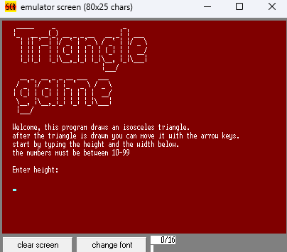
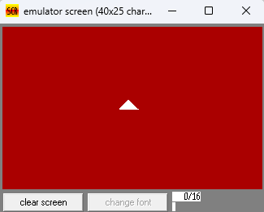
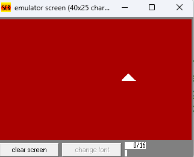
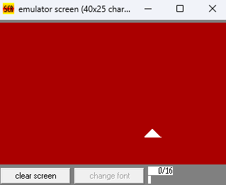
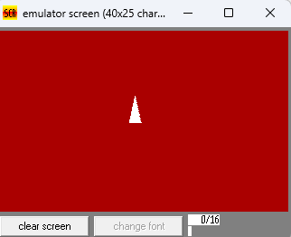
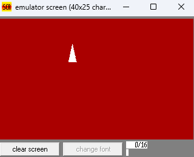

# TriangleGame

## Table of contents
[What does the program do?](#what-does-the-program-do)  
[Usage](#usage)  
[Screenshots](#screenshots)  
[Development Stages](#development-stages)  
[Future Features](#future-features)  
[Reflection](#reflection)  

## project info

**Project Name:** Triangle Game   
**Programmar:** Omer Polak   
**Grade:** 10   
**Class:** 3  
**Teacher** Barak Suberri   
**School:** Yeshivat Bnei Aquiva Givat Shmuel   
**Year Of Submission:** 2023    

## What does the program do?
The program takes height and width numbers from the user and draws an isosceles triangle.
After the triangle is drawn the user can move it using the arrow keys. The user can press multiple keys a once and the triangle will be moved by the order the keys were pressed using the buffer.

## Usage
1. execute the file using an assembly 8086 emulator.
2. insert the triagle size - height and width
3. wait until the triangle is drawn.
4. move the triangle by pressing the arrow keys.

## screenshots
#### menu

#### 12*12 Triangle

#### 32*14 Triangle

## development stages
1. Drawing the triangle.
2. Writing the **MoveTriangle** proc.
3. Designing the menu with the big title and the instructions to the program.
4. Taking input from user. 
5. Writing a proc that makes the ASCII input a numerical value.
6. Handling edge cases.

## future features
I would add:
1. better ui
2. support diagonal movement 

# reflection
This project helped me get to know stages in software development, learn new skills, understand the language better, learn to solve problems and more importantly connect to the field.
